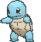

## Olá! Eu sou Leomar, desenvolvedor de software!

 - 🗺️ Sou do Rio de Janeiro, Brasil
 - 🚴🏼 Gosto de andar de bicicleta
 - 🎮 Gosto de jogos
 - 📜 Eu estudava licenciatura em história antes de entrar para a tecnologia
 - 💻 Trabalho como desenvolvedor fullstack na Win.win

  

 ##
 
 

  

  
### Stacks

  

## Contato

 

  
  
  

 

